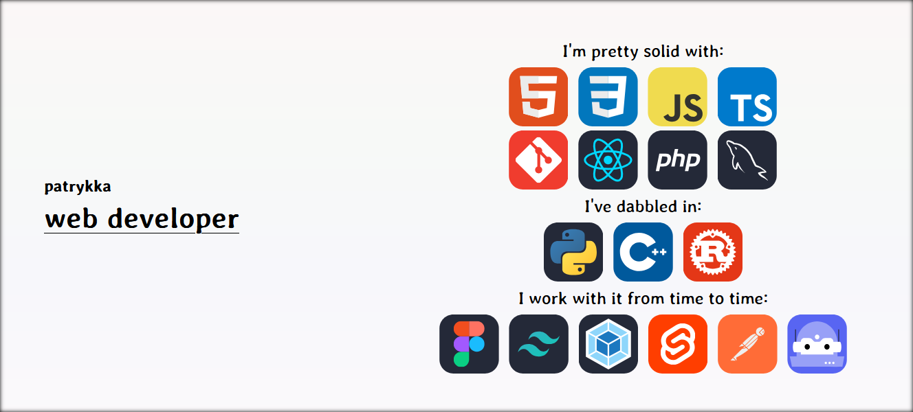

<!-- Image Map Generated by http://www.image-map.net/ -->

<map name="image-map">
  <area
    target="_blank"
    alt="HTML"
    title="HTML"
    href="https://www.w3.org/html/"
    coords="826,184,740,99"
    shape="rect"
  />
  <area
    target="_blank"
    alt="CSS"
    title="CSS"
    href="https://www.w3.org/Style/CSS/Overview.en.html"
    coords="926,183,842,99"
    shape="rect"
  />
  <area
    target="_blank"
    alt="JAVASCRIPT"
    title="JAVASCRIPT"
    href="https://262.ecma-international.org/14.0/"
    coords="1026,184,940,97"
    shape="rect"
  />
  <area
    target="_blank"
    alt="TYPESCRIPT"
    title="TYPESCRIPT"
    href="https://www.typescriptlang.org/"
    coords="1042,99,1130,184"
    shape="rect"
  />
  <area
    target="_blank"
    alt="GIT"
    title="GIT"
    href="https://git-scm.com/"
    coords="740,189,826,275"
    shape="rect"
  />
  <area
    target="_blank"
    alt="REACTJS"
    title="REACTJS"
    href="https://react.dev/"
    coords="842,190,929,276"
    shape="rect"
  />
  <area
    target="_blank"
    alt="PHP"
    title="PHP"
    href="https://www.php.net/"
    coords="941,189,1028,277"
    shape="rect"
  />
  <area
    target="_blank"
    alt="MYSQL"
    title="MYSQL"
    href="https://www.mysql.com/"
    coords="1044,189,1130,277"
    shape="rect"
  />
  <area
    target="_blank"
    alt="PYTHON"
    title="PYTHON"
    href="https://www.python.org/"
    coords="789,325,875,411"
    shape="rect"
  />
  <area
    target="_blank"
    alt="C++"
    title="C++"
    href="https://isocpp.org/"
    coords="891,325,979,409"
    shape="rect"
  />
  <area
    target="_blank"
    alt="RUST"
    title="RUST"
    href="https://www.rust-lang.org/"
    coords="991,326,1079,409"
    shape="rect"
  />
  <area
    target="_blank"
    alt="FIGMA"
    title="FIGMA"
    href="https://www.figma.com/"
    coords="634,459,726,545"
    shape="rect"
  />
  <area
    target="_blank"
    alt="TAILWINDCSS"
    title="TAILWINDCSS"
    href="https://tailwindcss.com/"
    coords="740,458,828,545"
    shape="rect"
  />
  <area
    target="_blank"
    alt="WEBPACK"
    title="WEBPACK"
    href="https://webpack.js.org/"
    coords="838,459,929,545"
    shape="rect"
  />
  <area
    target="_blank"
    alt="SVELTEJS"
    title="SVELTEJS"
    href="https://svelte.dev/"
    coords="944,459,1028,546"
    shape="rect"
  />
  <area
    target="_blank"
    alt="POSTMAN"
    title="POSTMAN"
    href="https://www.postman.com/"
    coords="1044,457,1131,546"
    shape="rect"
  />
  <area
    target="_blank"
				alt="DISCORD BOTS"
				title="DISCORD BOTS"
				href="https://discord.com/developers/docs/intro"
				coords="1141,459,1232,545"
				shape="rect"
			/>
		</map>
